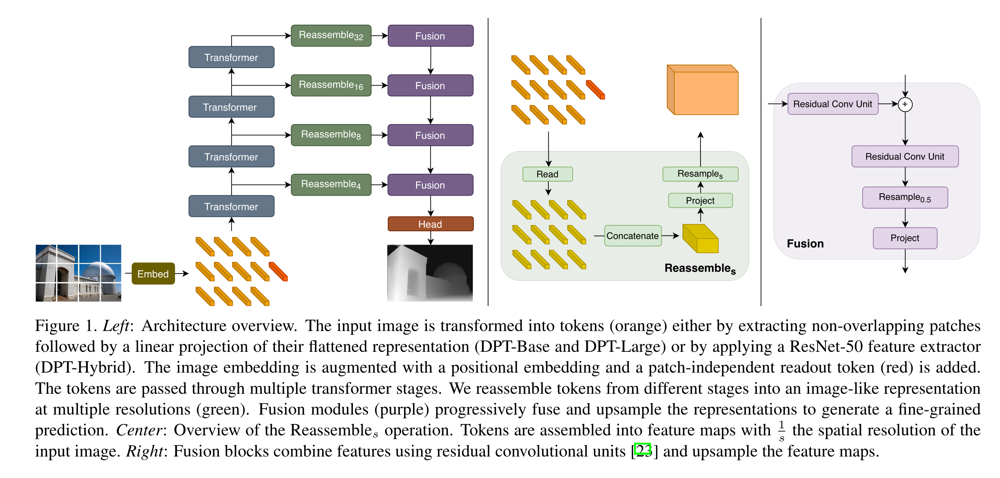

# Welcome to 3DPointCloudLab - Navigating the Depths of 3D Imaging

🌐 Explore the World in 3D: 3DPointCloudLab is your gateway to the fascinating universe of 3D depth maps and point clouds. Whether you're a researcher, developer, or 3D enthusiast, our repository offers a treasure trove of tools, techniques, and insights dedicated to the exploration and manipulation of 3D spatial data.

🔍 Depth Map & Point Cloud Processing: Dive into our comprehensive toolkit designed for processing, analyzing, and visualizing 3D depth maps and point clouds. From generating depth maps from 2D images to transforming them into intricate 3D point clouds, 3DPointCloudLab is engineered to bring your 3D visions to life.

💡 Innovate and Collaborate: With a focus on community-driven development, we invite you to contribute, experiment, and share your unique 3D projects. Join us in pushing the boundaries of 3D imaging technology!

Start your 3D journey with 3DPointCloudLab and uncover the hidden dimensions of the world around us!

# Using Dense Vision Transformers (DVT) for Enhanced Dense Prediction Tasks
In our project, we're excited to leverage the cutting-edge Dense Vision Transformers (DVT), a novel architecture that fundamentally transforms the way we approach dense prediction tasks in computer vision. DVT stands at the forefront of innovation, replacing traditional convolutional networks with vision transformers, thereby redefining efficiency and accuracy in our models.

# Key Highlights of DVT in Our Project:
**Transformer Backbone:** At the heart of DVT is the vision transformer (ViT) which operates on a high-resolution and maintains a global receptive field at every stage. This backbone ensures that our model processes representations with consistent spatial resolution throughout, making it highly effective for tasks requiring detailed spatial understanding.

**Enhanced Image Representation:** DVT assembles tokens from various stages of the transformer into multi-resolution image-like representations. These representations are then combined using a convolutional decoder into full-resolution predictions, capturing finer details more coherently compared to traditional fully-convolutional networks.

**Global Receptive Field:** Unlike convolutional networks that increase their receptive field through successive layers, the transformer in DVT maintains a global receptive field from the start. This characteristic allows for more globally coherent predictions and a better understanding of the overall scene.

**State-of-the-Art Performance:** Our implementation of DVT has shown substantial improvements on a variety of dense prediction tasks. Notably, in monocular depth estimation, we've observed up to a 28% improvement in relative performance over state-of-the-art fully-convolutional networks.

**Versatility Across Datasets:** The architecture has proven its mettle across different scales of data. From setting new benchmarks on the ADE20K dataset in semantic segmentation (achieving 49.02% mIoU) to excelling on smaller datasets like NYUv2, KITTI, and Pascal Context, DVT adapts and excels universally.

