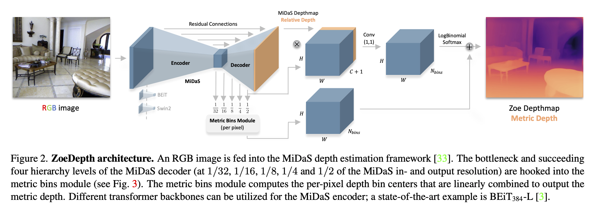
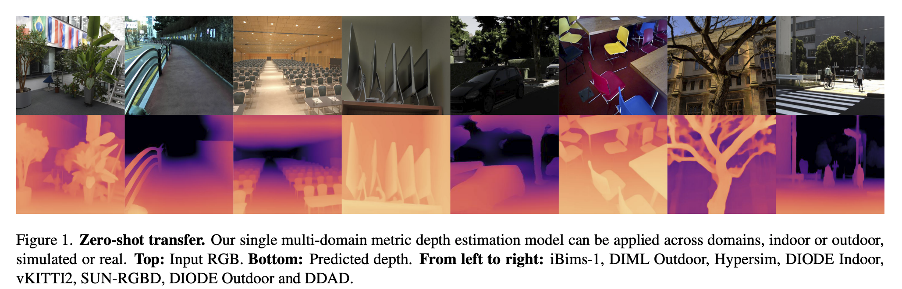

# Welcome to 3DPointCloudLab - Navigating the Depths of 3D Imaging

🌐 Explore the World in 3D: 3DPointCloudLab is your gateway to the fascinating universe of 3D depth maps and point clouds. Whether you're a researcher, developer, or 3D enthusiast, our repository offers a treasure trove of tools, techniques, and insights dedicated to the exploration and manipulation of 3D spatial data.

🔍 Depth Map & Point Cloud Processing: Dive into our comprehensive toolkit designed for processing, analyzing, and visualizing 3D depth maps and point clouds. From generating depth maps from 2D images to transforming them into intricate 3D point clouds, 3DPointCloudLab is engineered to bring your 3D visions to life.

💡 Innovate and Collaborate: With a focus on community-driven development, we invite you to contribute, experiment, and share your unique 3D projects. Join us in pushing the boundaries of 3D imaging technology!

Start your 3D journey with 3DPointCloudLab and uncover the hidden dimensions of the world around us!

# 01. Using Dense Vision Transformers (DVT) for Enhanced Dense Prediction Tasks
In our project, we're excited to leverage the cutting-edge Dense Vision Transformers (DVT), a novel architecture that fundamentally transforms the way we approach dense prediction tasks in computer vision. DVT stands at the forefront of innovation, replacing traditional convolutional networks with vision transformers, thereby redefining efficiency and accuracy in our models.

## Key Highlights of DVT in Our Project:
**Transformer Backbone:** At the heart of DVT is the vision transformer (ViT) which operates on a high-resolution and maintains a global receptive field at every stage. This backbone ensures that our model processes representations with consistent spatial resolution throughout, making it highly effective for tasks requiring detailed spatial understanding.

**Enhanced Image Representation:** DVT assembles tokens from various stages of the transformer into multi-resolution image-like representations. These representations are then combined using a convolutional decoder into full-resolution predictions, capturing finer details more coherently compared to traditional fully-convolutional networks.

**Global Receptive Field:** Unlike convolutional networks that increase their receptive field through successive layers, the transformer in DVT maintains a global receptive field from the start. This characteristic allows for more globally coherent predictions and a better understanding of the overall scene.

**State-of-the-Art Performance:** Our implementation of DVT has shown substantial improvements on a variety of dense prediction tasks. Notably, in monocular depth estimation, we've observed up to a 28% improvement in relative performance over state-of-the-art fully-convolutional networks.

**Versatility Across Datasets:** The architecture has proven its mettle across different scales of data. From setting new benchmarks on the ADE20K dataset in semantic segmentation (achieving 49.02% mIoU) to excelling on smaller datasets like NYUv2, KITTI, and Pascal Context, DVT adapts and excels universally.

# 02. ZoeDepth: Zero-shot Transfer by Combining Relative and Metric Depth

Our second depth model, ZoeD-M12-NK, represents a breakthrough in single-image depth estimation, merging the strengths of relative and metric depth estimation into a cohesive framework. This model is distinguished by its exceptional generalization capabilities and adherence to metric scale, setting new standards in depth estimation accuracy and versatility.

**Key Innovations and Features:**
Hybrid Training Approach: ZoeD-M12-NK is uniquely pre-trained on 12 diverse datasets for relative depth estimation and subsequently fine-tuned on two specific datasets for metric depth. This hybrid training strategy enhances the model's adaptability and precision across various domains.

**Metric Bins Module:** A novel component in our architecture, the metric bins module efficiently adjusts bin centers at different decoder layers, unlike traditional methods that rely on splitting bins. This adjustment is driven by attractor points predicted for each pixel, leading to more accurate and refined depth estimations.

**Attractor Layers:** Our model introduces an innovative concept of attractor layers, where bin centers are dynamically adjusted (attracted) based on the depth interval. This strategy refines the depth prediction process, allowing for more precise and focused depth estimations as the decoder layers progress.

**Log-binomial Probability Distribution:** Moving away from the conventional softmax approach, we employ a log-binomial distribution for predicting probabilities over bin centers. This method acknowledges the ordinal nature of bins, ensuring a more realistic probability distribution and enhancing the overall accuracy of depth predictions.

**Unified Training and Generalization:** ZoeD-M12-NK stands out for its ability to train jointly on multiple datasets (e.g., NYU Depth v2 and KITTI) without significant performance degradation. Furthermore, it exhibits unprecedented zero-shot generalization to eight unseen datasets, encompassing both indoor and outdoor environments.

**Performance and Impact:**
ZoeD-M12-NK has demonstrated significant improvements over existing state-of-the-art models. On the NYU Depth v2 indoor dataset, it achieves a remarkable 21% improvement in terms of relative absolute error (REL). Its ability to train across multiple datasets and generalize to new, unseen datasets marks a significant advancement in the field of depth estimation.

